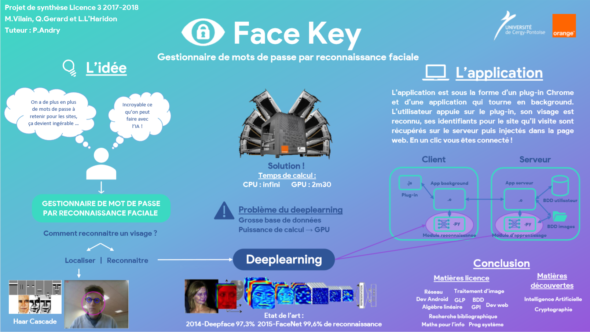

# Face_Key

Face Key is a password manager witch use face recognition.
It was made for the final project of undergrad of computer science in the Cergy-Pontoise University.

## Context

Nowadays we observe that we have to login in a large number of website that we use every day : social network, mail, news, phone operator ... It's beginning to become very hard to have secure password for every website so we usually use the same password for multiple website and we choose simple password witch is not secure at all. You can also let your account open but obviously it's not secure if someone access to your computer.
A solution that has been develop is the password manager (PM). It is software that manage your password for you. You only have to remember the password of the PM and it will unlock for you the website that you are visiting. The issue of this solution is that we still have to remember a hard password, so lot of people prefer to choose a simple password for their PM witch is also not secure at all. Furthermore, even if the users choose a long and secure password for their PM, it will take them time to write it each time they want to connect to a website.

Alongside that, with the growing of deeplearning particularly, the technique of face recognition are becoming very effective. Some algorithm already are more accurate than human in this field. (Chaochao Lu and Xiaou Tang 2014). And lot of company are working on the question, for exemple Facebook with Deepface 2014, Microsoft with Hello 2015 and Apple with FaceID 2017. Research also shown that face recognition can be less hackable than a password.

## The idea

The idea of Face Key is to combine a password manager with deeplearning technology to recognize the face of the user. It will resolve the issue of password that we have to learn and it will allow very high speed connection. It don't require sensor like IR sensor on the Iphone X, it can technically run on every device that have a webcam.

The application is made of a Chrome plug-in and a background application on the computer of the user. The user only only have to click on the plug-in Face Key when he his on the connection page. The name of the site will be given to the background application. This last one will send it to our Face Key server to check if he has a account for this website. If he has, the background application will take photos of his face and pass them in a neural network that has learned to recognize him. If he is recognize, username and password will be
found on the Face Key User database and put into the webpage and the account will be unlock.
Just yby a glance the account is safely unlock.

Format: 
